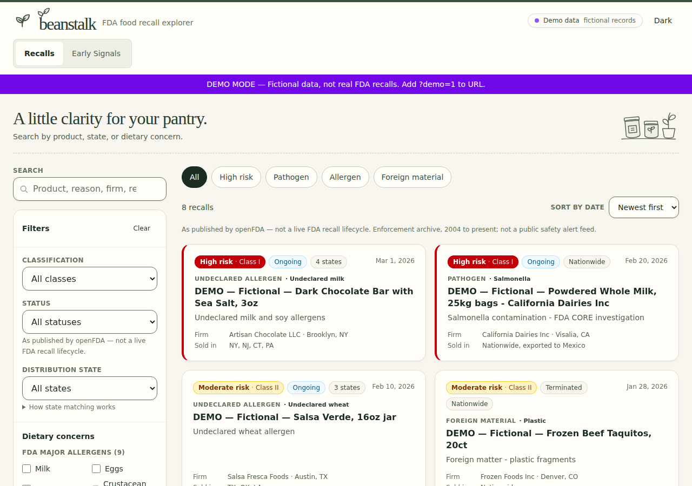

<p></p>

# Beanstalk

**FDA food recall records without the guesswork.**

Beanstalk is a calm, searchable interface for the FDA's food enforcement archive and CAERS adverse event early signals. Search by product, hazard, or company; narrow results by risk class, status, state, or dietary concern; then open a record for its source fields and FDA links.

> Beanstalk is a record browser, not a real-time safety alert service. Recall data is **as published by openFDA**, not a live FDA recall-lifecycle feed. Statuses may stay Ongoing after a recall ends. Verify the source notice before acting.

[**Open the app**](https://jacobrakaifoundation.github.io/beanstalk/) · [Browse openFDA's source](https://open.fda.gov/apis/food/enforcement/) · [Report a problem](https://github.com/jacobrakaiFoundation/beanstalk/issues)



<sub>Demo mode. Every record shown is fictional and labeled as such in the app; live mode shows records as published by openFDA. Screenshot 11 September 2026.</sub>

## What it does

- Searches FDA food enforcement records by product, reason, and recalling firm.
- Surfaces Early Signals from unverified CAERS adverse event reports.
- Filters by FDA classification, status, distribution state, and dietary terms.
- Sorts listed recalls by date (newest first by default).
- Shows provenance, distribution, code information, and source links in a detail drawer.
- Saves successful queries in the browser so a clearly labeled saved copy can remain available during a temporary FDA/API failure.
- Supports a local watchlist with optional browser alerts while the app is open.
- Installs as a lightweight PWA and includes an explicit fictional demo mode at `?demo=1`.

Live mode uses records **as published by openFDA**. Demo records are labeled fictional; they are never presented as live recalls.

## Data and trust boundary

Beanstalk reads the [openFDA Food Enforcement API](https://open.fda.gov/apis/food/enforcement/) and [openFDA Food Adverse Event API](https://open.fda.gov/apis/food/event/) (CAERS). Records are **as published by openFDA**, not a live FDA recall-lifecycle feed. The app preserves FDA-provided fields, identifies saved results when live retrieval fails, and links back to FDA source views for verification.

This project is not medical advice. For meat, poultry, or processed egg products, also check [USDA FSIS recalls](https://www.fsis.usda.gov/recalls).

### openFDA search and freshness gotchas

- **Empty / no-match search → HTTP 404** is expected. openFDA returns `404` + “No matches found”; Beanstalk treats that as zero results, not an outage.
- **Wednesday publish lag.** The enforcement dataset typically refreshes mid-week. Do not treat “retrieved today” as a same-day FDA lifecycle update.
- **`skip` max 25,000.** openFDA rejects deeper offset paging. This app caps `skip` and does **not** use `search_after`. Narrow filters to see more of a large result set.
- **Related Events** use a parenthesized **OR** of product tokens (not a single phrase; [#102](https://github.com/jacobrakaiFoundation/beanstalk/pull/102)). Do not treat a zero-hit related-events list as an API failure.

## Run it locally

```bash
git clone https://github.com/jacobrakaiFoundation/beanstalk.git
cd beanstalk/food-recall-app
npm ci
npm run dev
```

Open [http://localhost:5173](http://localhost:5173). The local Vite server proxies FDA requests through `/api/food` and can add `OPENFDA_API_KEY` server-side when one is configured. The client bundle does not contain an API key.

## Verify a change

Run these from `food-recall-app/`:

```bash
npm run check
npx tsc --noEmit
npm test
npm run build
```

For UI changes, also check the live-data, empty, unavailable, filtered, paginated, detail-drawer, keyboard, dark-mode, and 375/768/1280px paths.

## Project layout

```text
food-recall-app/
├── src/components/   UI and accessible interaction patterns
├── src/lib/          openFDA mapping, filters, caching, and tests
├── src/types/        normalized recall data types
└── public/           PWA icons and static assets
docs/readme/          screenshots used on this page, date-stamped
```

## Support

[Support JACOBRAKAI FOUNDATION](https://donate.stripe.com/eVq4gy97DanS9h60phfrW00), a 501(c)(3) public charity (legal name JACOBRAKAI FOUNDATION; EIN 33-3382083).
